# 6 Run

## Table of Contents
- [Description](#section1)
- [Overview](#section2)
- [Settings](#section3)
- [Release Business Project](#section4)
- [Deploy Business Project](#section5)
- [Activate your Visibility Scenario](#section6)
- [Run the Process](#section7)
- [Work on the Tasks](#section7a)
- [Monitor the Process](#section8)
- [Gain Visibility into the Process](#section10)
- [Summary](#summary)
- [Support](#support)
- [License](#licence)

## Description 

**SAP Process Automation** have dedicated **Monitoring** page that collects events coming from the deployed workflows and automation jobs and presents them to the user. These events represent the state of the agents, the status of the jobs that have been run, and the business activity of monitoring events.

The **Application Development** offers these are different monitoring apps:
   - **Process and Workflow Instances**: you can see a list of all workflow instances and act on those instances.
   - **Automation Jobs**: you can view all your automation errors, warnings, variables, and other information on the console.
   - **Acquired Events**: you can view the events that have been acquired by the process visibility.
   - **Visibility Scenarios**: you can manage your visibility scenarios by scheduling the job for processing the data and clearing the processed data. You can also view the processing log information and the details of a scenario definition in this view.

## Overview 

This part contains the material to Release, Deploy & Run the Business Process 

   - Release and Deploy
   - Run the Process
   - Monitor the Process
   - Gain Visibility into the Process

## Requirements 

Now that you have your project free of errors, ready to be released, you need to add **ATTRIBUTE** to your project.

1. In your project in Process Builder:
    - Click on **Settings** (1)
    - Click on Attributes (2)
    - Choose **Sales Orders** (3)
    - Enter your **ID Number** and press **ENTER** (4) 
    - Click **Save** (5)
    - Click **Close** (6)    

    

## Settings 

Go back to the "Lobby", and then select "Settings" on top (or click here: https://spa-workshops-bootcamp-applicationdevelopment.lcnc.cfapps.eu10.hana.ondemand.com/settings)

1. In **Agent List** verify that your Agent is Idle or Ready and connected in Unattended mode then click on it

2. Click on Manage Attributes 

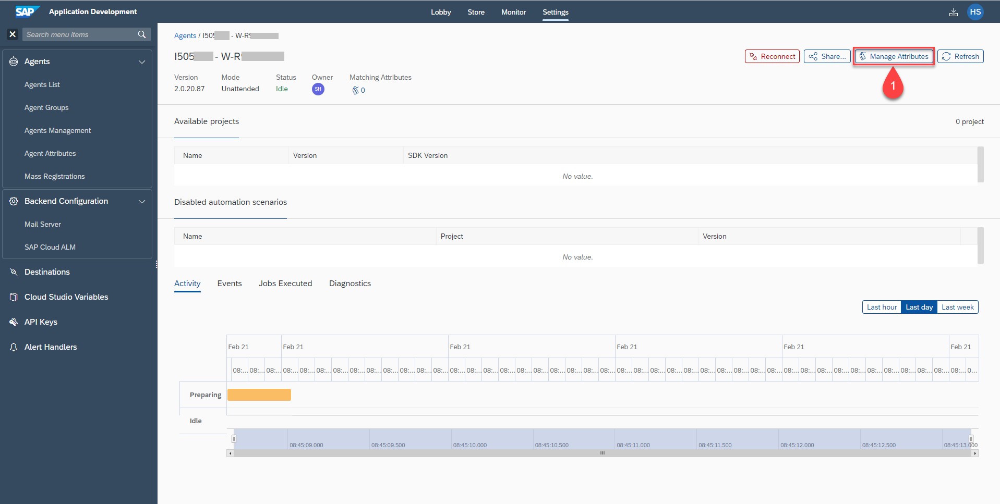

3. Add your attribute

    - Choose **Sales Orders** (1)
    - Enter your **ID Number** and press **ENTER** (2) 
    - Click **Confirm** (3)

4. Click on **Agent Management** then, click on **Add Agent**

   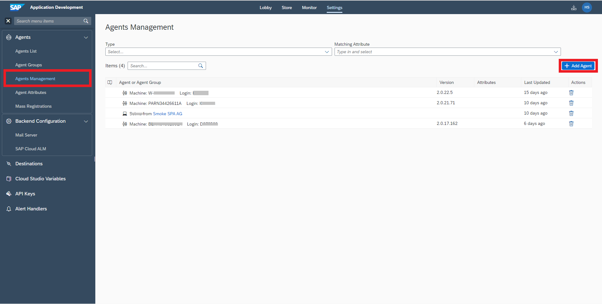

5. Select your Agent and click **Add Agent** then, click on **Add Agent**

   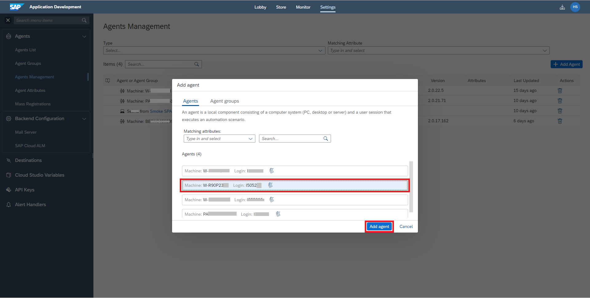

6. Your agent is now added and ready to run automations

   
## Release Business Process Project 

Release individual projects once they are finished. 

There are two possible  situations:
   - When you're releasing a new business process project, enter a brief summary of the changes in the **Release Notes** (optional) then Choose **Release**
   - When you're releasing a modified version of a business process project that is already released, in the Release **Version Contains dialogue**, select one of the following:
        - Select **Bug Fix** to indicate bug fixes. It updates the third digit of the version number.
        - Select **Minor Changes** to indicate small modifications. It updates the second digit of the version number.
        - Select **Major Changes** to indicate important modifications potentially leading to incompatibility between versions. It updates the first digit of the version number.

1. In the Process Builder, click on **Release**

    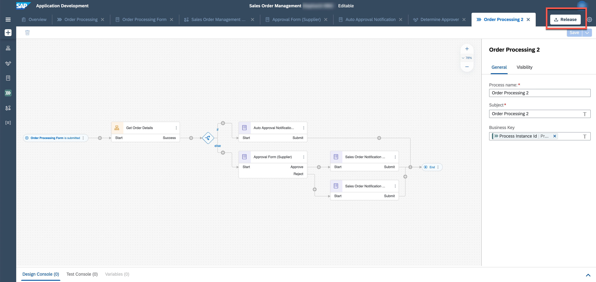

2.a For the first version, add a **Version Comment** if needed and click on **Release**

   

2.b For the additional version, choose the type of version, add a **Version Annotation** if needed and click on **Release**

   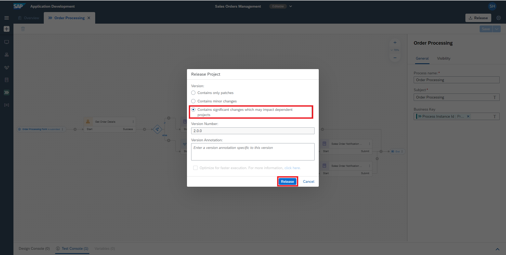

3. The project Released successfully is ready to be deployed
    > If needed, you can refer to the [Documentation](https://help.sap.com/viewer/d668fd319a104511b515d574782b497f/Dev/en-US/5ec3714e12ce487da35c009505eaf3a5.html)

   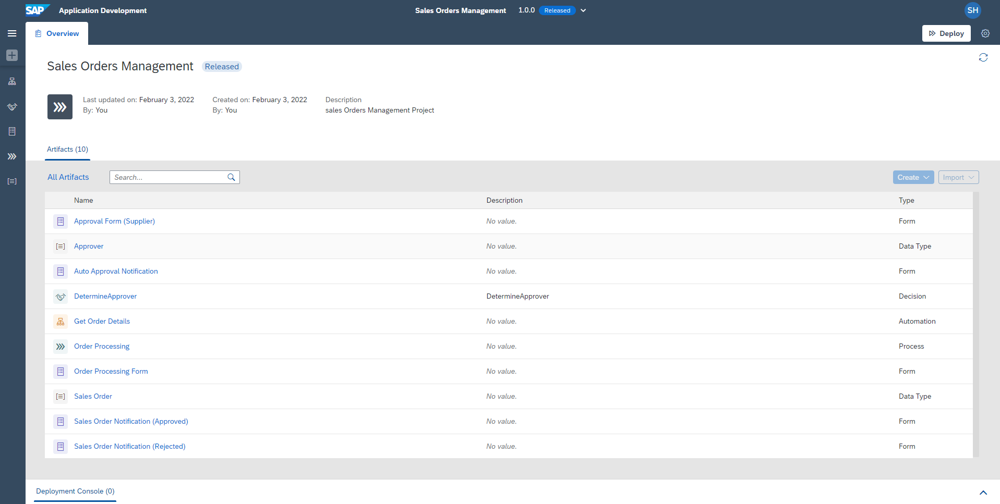

## Deploy Released Project

You can deploy business process projects from each released version of the project in the Process Builder or through Lobby.

1. From the released version of the business process project in the Process Builder, click on **Deploy**

2. Fill the **Variables** and click on **Confirm**

   Variables allow you to reuse certain information for a given business process project deployement.

   You use variables to pass parameters to automations. You can create variables in the Process Builder for which you can later set values when deploying the  business process project. For example, in the current use case, we create a "Filepath" variable with a string value that contains the local filepath of the Sales Orders Details Excel file used in the Automation.
   
> Please use the address where you have saved the Salesorderdetails file.

   

3. Click on **Deploy**

   

4. The project Deployed successfuly is ready for running and monitoring

   

## Activate your Visibility Scenario

1. Move back to the entry screen and select the **SAP** logo.

    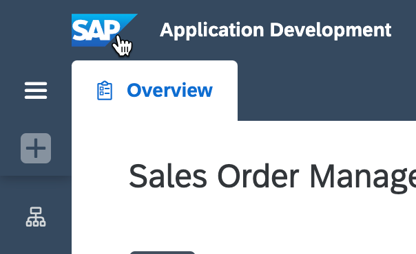 
    
2. Select the tab **Monitor**.

    
    
3. Move to **Manage** and click **Visibility Scenarios**.

    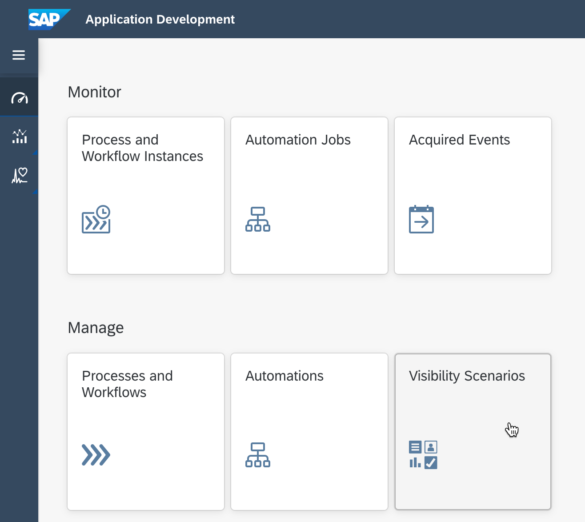
    
4. **Search** for your scenario
> That's why we have asked for a unique name.

   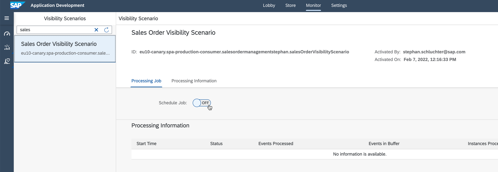
   
5. To be able to get the required events and data into the dashboard we have configured before, you need to start the processing job. Change the switch from **OFF** to **ON**. 
 
5. In the pop-up window select **OK**.

   

   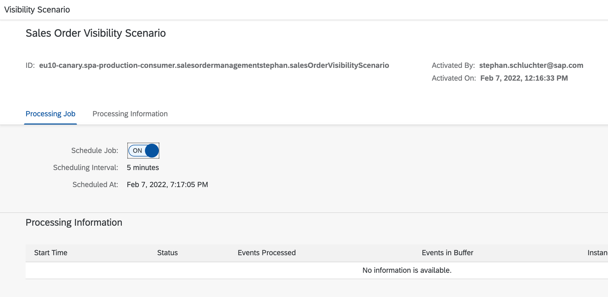

## Run Business Process 

1. From the deployed version of the Business Process Project in the Process Builder, open the process **Order Processing**

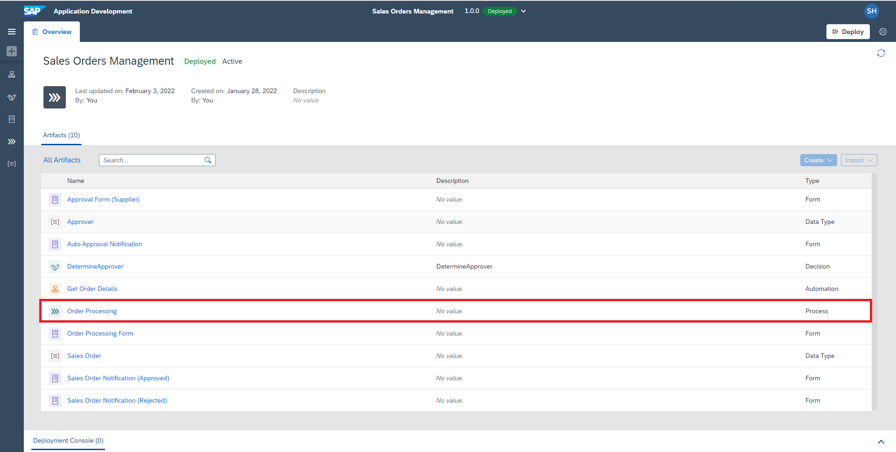

2. Click on the **Copy** icon aside the **Form Link**

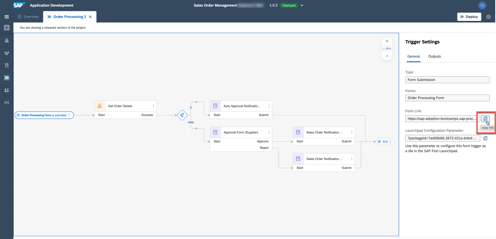

3. Open the Form pasting the *Form Link** in a browser window

4. Fill the Order details and click on **Submit**

> For order number please use any of existing in excel, e.g. "PO7918"

5. The process is triggered. You can now work on the tasks, monitor the process and gain insights. 

## Work on the Tasks 

1. Start in the **Lobby** and open the **My Inbox** application by selecting the button  at the top right corner.

2. After opening the **My Inbox** application, you see on the left-hand side all the tasks listed. **Select the task** assigned to you. 

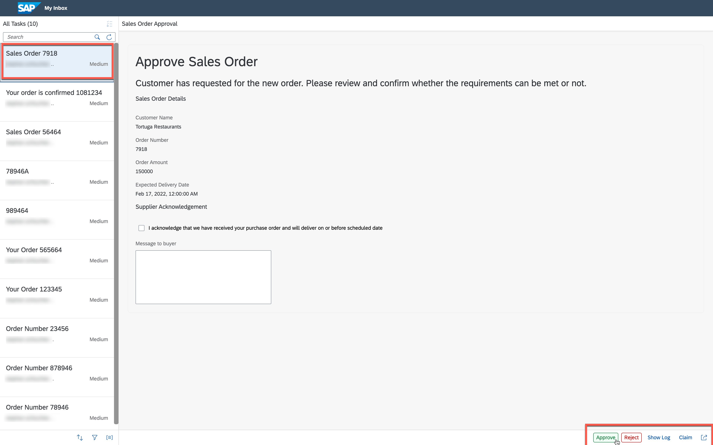

> The provided tasks and forms might look different than this screenshot, depending on your configurations.

3. Move on with one of the actions:   
 
**Approve**, **Reject**, **Show Log** (to see what has been done so far), **Claim** (to reserve this task for you) or **Mail** (to forward this task via email).

4. You could also **sort**, **filter** or **group** the tasks at the bottom of the task list with these buttons:  

5. Depending on your selected actions and the information you have provided at the start of the process, the next task could be to **confirm** the order.

>We have accessed the tasks now directly via the design environment. Of course, in real life this would most likely not be the case. The tasks will be accessed, for example, via the launchpad. Please follow the next steps to do so.

### Access the Task via the Launchpad ###

1. Access the launchpad via the URL (provided by the instructors).

2. Access and open the **My Inbox** application.

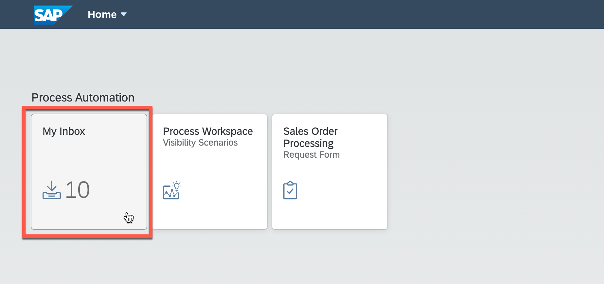

3. Select **your task** and perform the actions as done before.

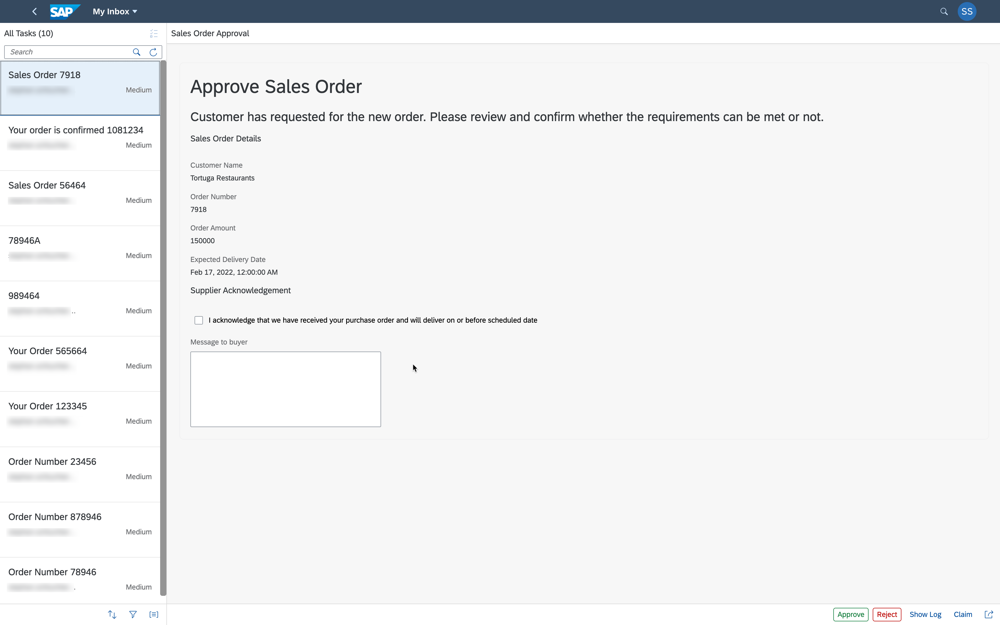

## Monitor Process and Automation 

1. Navigate into the monitoring tab and click on **Process and Workflow Instances**

    

2. Click on the **Order Processing** instance to check the status of the **CONTEXT** and **EXECUTION LOG** 

    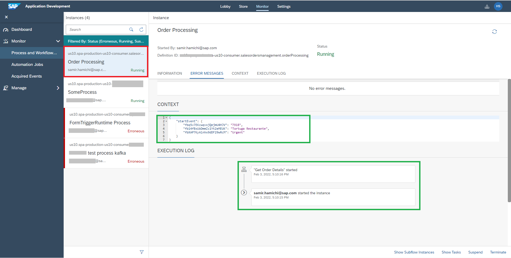

3. Go to **Automation Jobs** under **Monitor**

    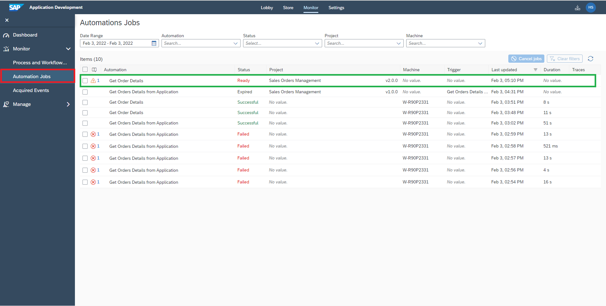

4. Click on the **Warning** icon (if applicable) to learn more about the Automation
    > If this is the case, go to the **Settings** section and add your agent in order to run the Automation Job.

    

You will see the Automation run successfuly as below:
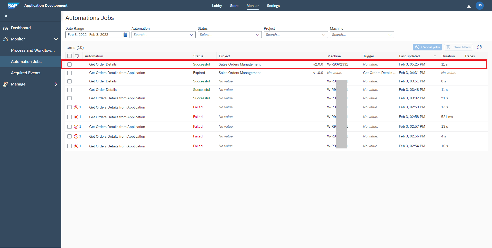

Notice the process instance progresses further to the the approval step in the business process

## Gain Visibility into the Business Process 

1. Navigate via the URL to the Launchpad (provided by instructors).
    
2. Select **Process Workspace (Visiblity Scenarios)**.

    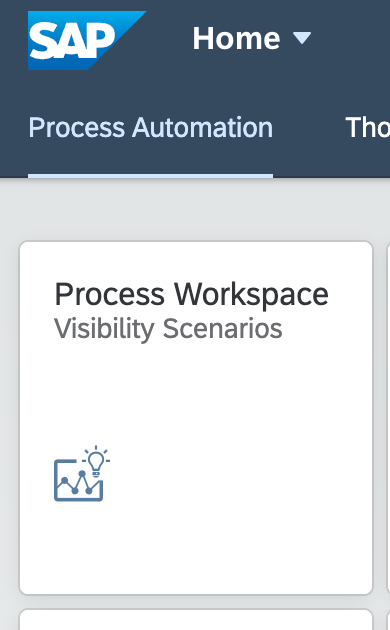
    
3. **Search** for your visibility scenario and **select** it.

    

4. Well, probably there is not too much to observe now. But the more instance you have triggered and the more time elapsed, you will see more and more information on the dashboard. Make yourself familiar and browse through it.

    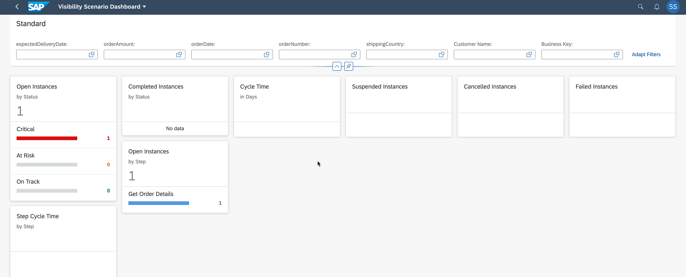

## Summary 

## How to obtain support 

Support for the content in this repository is available during the actual time of the online session for which this content has been designed. Otherwise, you may request support via the [Issues](../../../../issues) tab.

## License 

Copyright (c) 2022 SAP SE or an SAP affiliate company. All rights reserved. This project is licensed under the Apache Software License, version 2.0 except as noted otherwise in the [LICENSE](../LICENSES/Apache-2.0.txt) file.
