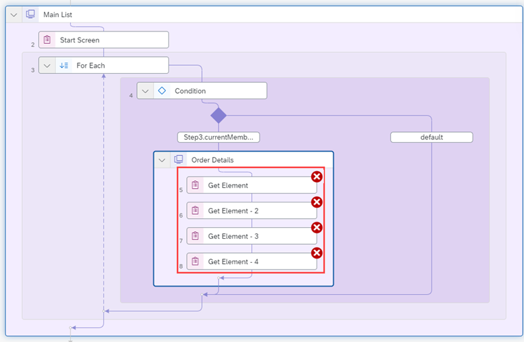
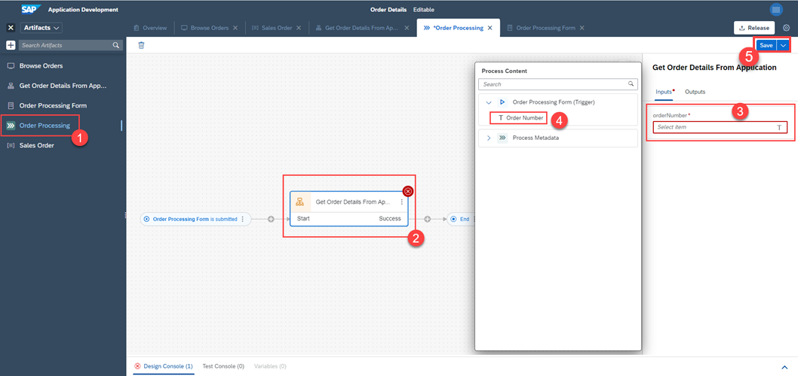
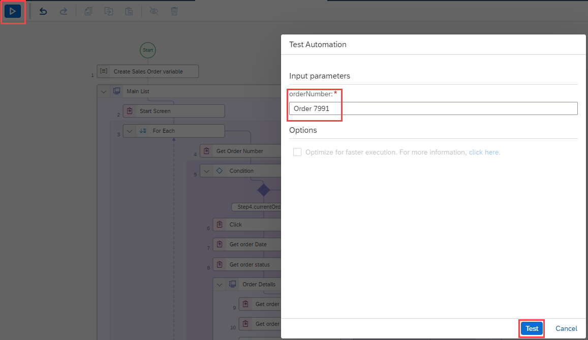

# Table of Contents
- [Table of Contents](#table-of-contents)
- [Create a project](#create-a-project)
- [Capture an application](#capture-an-application)
  - [Create an application](#create-an-application)
  - [Declare application's screens](#declare-applications-screens)
  - [Set Screens Criteria](#set-screens-criteria)
  - [Declare First Screen Elements](#declare-first-screen-elements)
  - [Declare Second Screen Elements](#declare-second-screen-elements)
- [Sales Order Data Type](#sales-order-data-type)
  - [Create a new data type](#create-a-new-data-type)
  - [Declare **Sales Order** data type fields](#declare-sales-order-data-type-fields)
- [The automation](#the-automation)
  - [Create automation](#create-automation)
  - [Set up inputs and outputs of automation](#set-up-inputs-and-outputs-of-automation)
  - [Adding activities](#adding-activities)
    - [Adding Screen activity](#adding-screen-activity)
    - [Looping Operation using For Each Control](#looping-operation-using-for-each-control)
    - [Get current loop iteration's order number](#get-current-loop-iterations-order-number)
    - [Add Condition inside For Each loop](#add-condition-inside-for-each-loop)
    - [Create a variable of a **Sales Order** data type](#create-a-variable-of-a-sales-order-data-type)
    - [Setting the automation's output value](#setting-the-automations-output-value)
    - [Adding click activity](#adding-click-activity)
    - [Adding the second application's screen](#adding-the-second-applications-screen)
    - [Get **Order Details** screen's elements](#get-order-details-screens-elements)
    - [Convert **Order Date** from a string to a **Date** object](#convert-order-date-from-a-string-to-a-date-object)
    - [Set Variable Value using Data Management Activities](#set-variable-value-using-data-management-activities)
    - [End the loop](#end-the-loop)
    - [Log Message](#log-message)
    - [Save your automation changes](#save-your-automation-changes)
- [Mapping the Automation parameters with Form Parameters](#mapping-the-automation-parameters-with-form-parameters)
- [Test Automation](#test-automation)
  - [Test Results](#test-results)
- [Summary](#summary)
- [How to obtain support <a name="support"></a>](#how-to-obtain-support-)
- [License <a name="license"></a>](#license-)

# Create a project 
This step involves the creation of a new project.

1.  Go to your **SPA Lobby** and click **Create** and click **Business Process**.

    

2.  Put the following information then click **Create**:

    | Field Name        | Value                                 |
    | :---------------- | :------------------------------------ |
    | Project Name      | Order Details                         |
    | Short Description | Get order details from an application |

    

A new project is created and automatically opened.


# Capture an application 
This step involves capturing the orders application and declaring its necessary elements.

## Create an application 
1.  Open `https://openui5.hana.ondemand.com/test-resources/sap/m/demokit/orderbrowser/webapp/test/mockServer.html` in a new window.

    

2.  Go back to your project and create a new **Application**.

    

## Declare application's screens
1.  Select **Browse Orders** Application that is detected automatically by the **Desktop Agent**.

2.  Select **Capture Application**, set **Screen Name** to **Main List** and click **Capture**.

    

    The first screen was captured and added to the application.

3.  Go back to your application window and click on the first order.

    

4.  Go back to the cloud studio. Click  besides **Browse Order** Application and click **Add Screen**.

    

5.  Select **Browse orders**, set **Screen name** to **Order Details** and click **Capture**.

    

The two screen are now captured and ready to be customized.


> The icon  signifies that the screen isn't uniquely identified. In the next step we fix that.


## Set Screens Criteria 
This step involves setting the **Criteria** to **Order Details** and **Main List** Screens so that they become uniquely identified.

1.  Click **Order Details**' **Screen**.

2.  Click **URL** on the right panel under **Captured Data** section.

    

3.  Click on the added **URL** Criterion, set **Operator** to **contains** and **Value** to `tab=shipping`. Click Apply.

    

4.  Repeat steps **1 ~ 3** to the **Main List** Screen with **Operator** set to **doesn't contain** and **Value** to `tab=`.

The two **Screens** are now uniquely identified.


## Declare First Screen Elements 
This step involves declaring the elements of the first screen.

1.  On the first screen click on the first order and remove **Text** from the **Recognition Criteria**. Set **Name** to **Orders**.

    

2.  Click **Is a collection**  to set the element as a collection.

    

3.  Click **Both** to open the **DOM Tree** and find the element for **Order number**.

4.  Set **Name** to **Order Number**.

5.  Remove **Text** from the **Recognition Criteria**.

    

6.  Click **class** criterion under **Captured Data** and click **Declare Element**.

    

7.  Click **Order Number** element and click **Is a collection** .

    

8.  Repeat steps **3~8** for the **Order Date** and **Order Status**.
    
    | Element      | Name             |
    | :----------- | :--------------- |
    | Order Date   | **Order Date**   |
    | Order Status | **Order Status** |
    
    

9.  Click **Save** to save changes.

    

**Main List** screen's elements are now declared.

## Declare Second Screen Elements 
This step involves declaring the elements of the second screen.

1.  Select the second **Screen**.

    

2.  Click on **410,418.22** .
3.  Remove **Text** **Recognition Criteria**.
4.  Click on **id** to add it to the **Recognition Criteria**
5.  Set **Name** to **Price**.
6.  Click **Declare Element**.

    

7.  Repeat steps **2 ~ 5** for **Shipping Address** 5 elements:

    

    | Element       | Name             | id (Criteria) |
    | :------------ | :--------------- | :------------ |
    | Name          | Address Name     | `__text37`    |
    | Street        | Address Street   | `__text38`    |
    | ZIP Code/City | Address zip city | `__text39`    |
    | Region        | Address Region   | `__text40`    |
    | Country       | Address Country  | `__text41`    |

8.  Click **Save** to save your changes

All the elements we need from both screens of the application are now declared and ready to be use.


# Sales Order Data Type 
This step involves creating **Sales Order** **Data Type** in which we will store order details later.

## Create a new data type
1.  Create a new **Data Type**.

    > **Data Types** are used to describe an entity's schema. An example of that would be describing a person using his: *First name*, *Second name*, *Age*, etc...
   
    

2.  Set **Name** to **Sales Order**.
   
    


## Declare **Sales Order** data type fields
1.  Click **New Field** to create a new field in the **Data Type**.

    
    
2.  Add the following fields:
   
    | Field Name           | Type   |
    | :------------------- | :----- |
    | orderNumber          | String |
    | orderDate            | Date   |
    | orderAmount          | Number |
    | shippingCountry      | String |
    | expectedDeliveryDate | Date   |
    | orderStatus          | String |

    

3. Click **Save** to save your changes.
    
**Sales Order** datatype is now ready to be used.


# The automation 
This step involves creating the automation to get an order's details given its number as an input.

## Create automation
1.  Create a new automation.

    

2.  Specify your **Desktop Agent**'s version.

3. Set **Name** to **Get Order Details From Application**.
4. Click **Create**.

    

A new **Automation** is created and opened automatically.


## Set up inputs and outputs of automation
We need to pass the **Order Number** as an input to our automation. And return an **Sales Order** as an output.

1. Click on the canvas of the automation then click **Input/Output**.

2. Click **Add new input parameter**.
   
    

3. Set **Name** to **orderNumber** *(Case sensitive)* and **Type** to **String**.
   
    

4. Click **Add new output parameter**.
5. Set **Name** to **order** and **Type** to **Sales Order**.

    

## Adding activities
### Adding Screen activity
1. From the panel on the right (**Automation Details**): 
   1. Search for **Main List** in the **Screens** menu.
   2. Drag-and-drop it in the automation.
   
    

2. Click on the screen in the automation then click **Define Screen Activities**.
   
    

3. Search **Start Screen** activity and drag-and-drop it inside the **Main List** screen.
   
    

4. Make sure the target is set to **Browse Orders > Main List** and set navigator to your navigator name.
 
    > Note: **SAP Intelligent Robotic Process Automation** browser extension must be installed in your navigator.

    

### Looping Operation using For Each Control
To loop over orders and find the wanted order, a **For each** activity is required.

1.  Search for **For each** activity and drag-and-drop it after **Start Screen** activity.
   
    

2.  Click on **For each** activity and set **Set looping list** to **Browse Orders > Main List > Orders**.

    

### Get current loop iteration's order number
3. We need to get the **Order Number** each iteration:
    1. click on **Main List** screen activity and click **Define Screen Activities**.
    2. Search and drag-and-drop **Get Element**.
    3. Click on the **Get Element** activity and set the output name to **currentOrderNumber**.
    4. change its name to **Get Order Number**
    5. Click on **Target Editor** and select **Browse Orders > Main List > Order Number**.
    6. Set **Index of the element** to **(3) index** and click **Confirm**.

        

### Add Condition inside For Each loop
To check wether the current **Order** matches the **Order** given in the input, we need to use a **Condition** activity.

1. Search for **Condition** and drag-and-drop it inside the **For each** activity.
  
    

2. Click on **Condition** activity that was just dropped.
3. Click **More Options** and select **Edit Formula**.
4. Paste this condition: `Step2.currentMember == Step0.orderNumber`
5. Click **Save Expression**.
   
    

### Create a variable of a **Sales Order** data type
We now need to create a new variable of type **Sales Order** that we created in [Create a new data type](#create-a-new-data-type).

1. Search **Sales Order** and drag-and-drop it before the **Main List** screen activity in the automation.
   
    

2. Click on **Create Sales Order variable** and set the output name to **order**.
   
    

### Setting the automation's output value
1. Click **End** on the automation
2. Set **order** to the created variable with the name **order**.
   
    

### Adding click activity
Once the right order is found, we need to click on it to show its details.

1. Click on **Main List** screen activity and click **Define Screen Activities**.
2. Search **Click** and drag-and-drop it inside the condition.
3. Click on **Click** activity and set target to **(3) currentMember**.

    

### Adding the second application's screen
1. Drag-and-drop **Order Details** screen inside the condition.
   
    

### Get **Order Details** screen's elements
1. Click on **Order Details** activity and click **Define Screen Activities** and search **Get Element**.
2. Drag-and-drop it **four** times inside **Order Details** screeb activity.
   
    

3. Click on the first **Get Element** activity.
4. Change the **Step name** to **Get order date**.
5. Change the output name to **orderDate**.
   
    

6. Click on **Target editor**.
7. Select **Browse Orders > Order Details > Order Date**.
8. Set **index** to **(3) index**.
9.  Click **Confirm**
    
    

10. Repeat steps **4-7** for the rest of **Get Element** activities, while following this:
   
    | Activity name   | Step name         | Target                                           | Output name | index         |
    | :-------------- | :---------------- | :----------------------------------------------- | :---------- | :------------ |
    | Get Element - 2 | Get order status  | `Browse Orders > Main List > Order Status`       | **status**  | **(3) index** |
    | Get Element - 3 | Get order price   | `Browse Orders > Order Details > Price`          | **price**   | /             |
    | Get Element - 4 | Get order country | `Browse Orders > Order Details > Adress Country` | **country** | /             |

### Convert **Order Date** from a string to a **Date** object
We now need to convert date from type **String** to **Date**. We use a small custom script to do that for us.

1. Search **Custom script** activity and drag-and-drop it after **Get Element - 4**.
2. Click on **Custom script** activity in the automation and click **Edit Script**.

    

3. Write this script as the content of our **Custom Script**.

    ```
    return {
        orderDate: new Date(strOrderDate)
    };
    ```

4. Add an input and an output parameter to the **Custom Script**:

    | Parameter | Name         | Type   |
    | :-------- | :----------- | :----- |
    | Input     | strOrderDate | String |
    | Output    | orderDate    | Date   |

    

5. Click again on **Custom Script** and set **strOrderDate** to **(7) orderDate**.

    

### Set Variable Value using Data Management Activities
Now, set the harvested values to the variable we created earlier.

1. Search **Set Variable Value** activity and drag-and-drop it after **Custom Script** activity.
2. Set **Variable** to **(1) order**.
3. Set value to **Custom Data**.
   
    Fields of data type **Sales Order** show up.

    Fill them as follows:

    | Field name      | variable            |
    | :-------------- | :------------------ |
    | orderNumber     | **(0) orderNumber** |
    | shippingCountry | **(10) country**    |
    | orderStatus     | **(8) status**      |

    For **orderAmount**: click expression editor and paste the following: `parseFloat(Step9.price.replace(',', ''))` .

    For **orderDate**: click expression editor and paste the following:
    `Date.new(Step12.orderDate)`.

    

### End the loop
Once the condition is met and the data gathered, we can exit the loop.

1. Search **Loop End** control.
2. Drag-and-drop it at the end of the condition block.

    

### Log Message
Use Log message activity to print your results. Let's use this activity to check selectedOrderDetails in Testing mode.


### Save your automation changes
Click **Save** to save your changes.


The complete automation **Get Order Details From Application** looks as below.


# Mapping the Automation parameters with Form Parameters
- Select **Get Order Details From Applicaiton** automation in the process Order Processing.
- Map the input parameter **orderNumber** of the automation  **Get Order Details From Applicaiton** with the **Order Number** of Order Processing Form.
- Click **Save** to save your changes.



# Test Automation
1. Click on **Test**.
2. Set **order number** to an existing order in the website (ex. **7991**).



## Test Results
1. Automation opens **Chrome** on the mockServer application.
2. Loops through all the orders and verifies whether the order with the order number given in the input exists. If it finds the order it clicks on it and sets the values present in the screen.
3. Ends the looping.
4. Prints the order details.


# Summary
You have successfully created and configured the process automation for the business process.

You are now able to:
 - [x] Create custom Data types.
 - [x] Capture an application with multiple screens. 

# How to obtain support <a name="support"></a>

Support for the content in this repository is available during the actual time of the online session for which this content has been designed. Otherwise, you may request support via the [Issues](../../../../issues) tab.

# License <a name="license"></a>

  Copyright (c) 2022 SAP SE or an SAP affiliate company. All rights reserved. This project is licensed under the Apache Software License, version 2.0 except as noted otherwise in the [LICENSE](../LICENSES/Apache-2.0.txt) file.